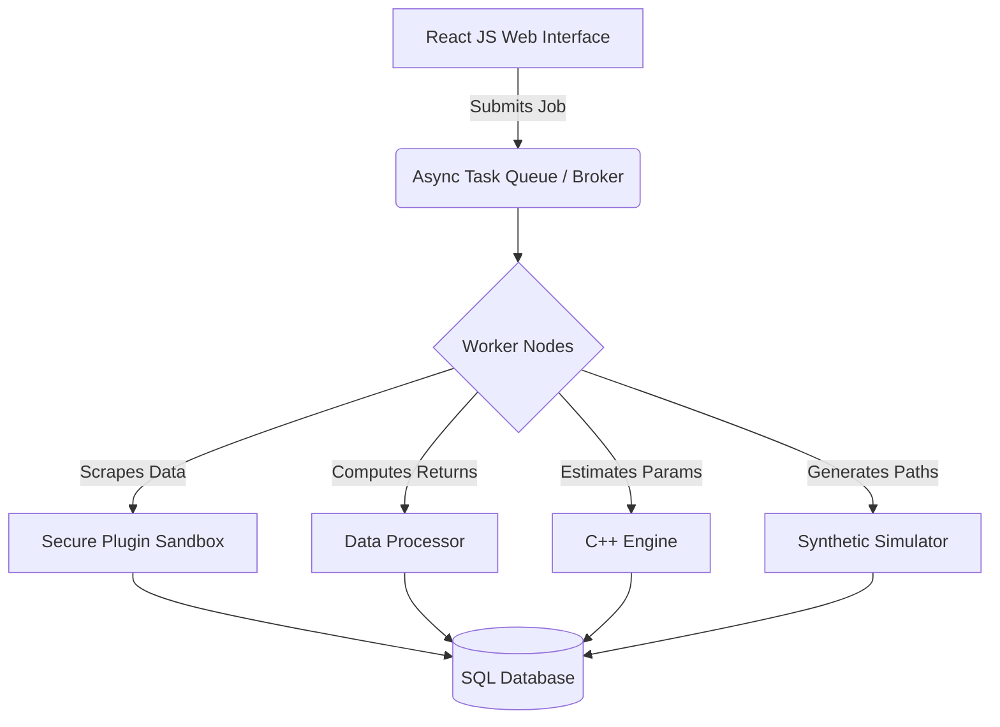

# Stochastic Market Simulator & Backtesting Platform


## Overview

This project is an end-to-end computational pipeline designed to scrape market data, estimate stochastic model parameters, and generate synthetic market data based on research-backed stochastic differential equations. 

The ultimate goal of this repository is to evolve into a **single-asset strategy backtesting platform**. Rather than testing trading strategies against a single historical timeline, this platform will simulate market behavior and test strategies across thousands of synthetic, Monte Carlo-style sample paths to validate statistical robustness but without the computational limitations imposed on standard Monte Carlo methods.

---

## 🏗️ Current Architecture (The Pipeline)

The system currently operates as a sequence of discrete modules:

### 1. Data Scraping Module
- **Technology:** Python, Selenium
- **Functionality:** Navigates complex, paginated data tables on specific financial URLs.
- **Output:** A raw CSV file containing: `Percent Change`, `Low Price`, `High Price`, `Open Price`, and `Close Price`.

### 2. Data Processing Module
- **Functionality:** Normalizes and prepares the scraped data for the estimation algorithm.
- **Transformations:** Computes the log returns based on daily closing prices to ensure time-series stationarity:
  ```math
  Log Return_t = \ln\left(\frac{Close_t}{Close_{t-1}}\right) \times 100
  ```

### 3. Parameter Estimation Engine
- **Technology:** C++
- **Dependencies:**
  - **Eigen (v5):** For high-performance matrix operations and linear algebra.
  - **nlopt (v2.11):** For multi-parameter function optimization (maximizing the likelihood function).
  - **fast-cpp-csv-parser:** For low-latency data ingestion.
- **Current Bottlenecks:** 
  - The engine is currently strictly **single-threaded**, preventing it from leveraging multi-core CPUs during complex optimization routines.
  - No GPU acceleration is implemented (due to hardware constraints and algorithmic design).

### 4. Synthetic Data Generator
- **Functionality:** Takes the optimized parameters outputted by the C++ engine and generates synthetic market data.
- **Implementation:** Simulates sample paths by numerical integration of the stochastic equations provided in the foundational research paper.

---

## 🚀 Future Vision & Architectural Refactoring

To transition from a static pipeline to a dynamic, user-facing backtesting platform, we are refactoring the architecture to support web controls, asynchronous processing, and custom data sources.

### Planned Architecture



### 1. Web-Based User Interface (React JS)
A dedicated React JS frontend will allow users to control the entire pipeline visually. Users can trigger scraping jobs, monitor parameter estimation progress, and visualize backtesting results across multiple simulated paths.

### 2. Asynchronous Task Processing Queue
Scraping, multi-parameter optimization, and stochastic simulation are highly CPU-intensive and blocking operations. So we introduce an async task queue (e.g., Celery with Redis or RabbitMQ) to decouple the React frontend from the backend. The web interface will submit jobs and poll for status updates, ensuring the UI remains responsive.

### 3. Standardized SQL Database & Data Schema
Relying on intermediate CSV files limits scalability, data integrity, and querying capabilities. So, we have a plan to migrate to a relational database (e.g., PostgreSQL). We will establish a standardized SQL schema to store raw scraped data, processed log returns, estimated parameters, and simulation state.

### 4. Secure Plugin-Based Scraping System
Every market and financial website has a unique DOM structure, meaning a one-size-fits-all Selenium script is impossible. So we're gonna implement a plugin system allowing users to upload custom Python scraping scripts.

To prevent Remote Code Execution (RCE) and unauthorized system access, user-submitted scripts will be executed in **highly restricted, ephemeral Docker containers**. These sandboxes will have dropped kernel privileges, no access to the host filesystem.

### 5. Cross-Platform Build System For The Estimation Engine
The estimation engine is currently written in C++17 using MSVC compiler and VS2022 as the IDE. Currently the build system is highly dependent on Windows specific tooling & ecosystem. We are planning to migrate the project to a CMake-based setup. We also need a better way to manage external C++ modules and dependencies.

### 6. VaR (Value at Risk) Calculation
We need to implement a system that uses one-step-ahead predictive distributions to calculate the expected VaR each day and graph it on a simultaneous graph along with daily log returns. What we expect is that, given a confidence level of 95%, the daily log-returns shouldn't fall below the VaR threshold except at most 5% of the time.

---

## 🛠️ Contributing & Setup
*(Currently in active refactoring—setup instructions will be updated as the SQL and Task Queue integrations are merged.)*

